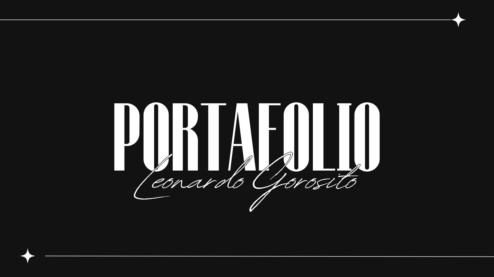

## Mi Portafolio

Este es un portafolio sencillo utilizando React JS. Aquí podrás encontrar información sobre mis habilidades, proyectos y formas de contacto.

## Funcionalidades Principales

- **Búsqueda y navegación de secciones**: Navega fácilmente por las diferentes secciones del portafolio.
- **Conexión a la base de datos**

### Capturas de Pantalla


## Tecnologías Utilizadas

- **React JS**: Biblioteca principal para construir la interfaz de usuario.
- **React Router**: Para la navegación entre las diferentes secciones del portafolio.
- **TailwindCSS**: Framework de CSS para el diseño y la estilización.
- **Firebase**: Plataforma para la gestión de la base de datos y autenticación.
- **Vite**: Herramienta de construcción rápida para proyectos de frontend.

## Instalación

Sigue estos pasos para configurar el proyecto localmente:

1. Clona el repositorio:
   ```bash
   git clone https://github.com/tu-usuario/tu-repositorio.git

## Uso
Para iniciar la aplicación en modo de desarrollo
**En cualquier terminal**: npm run dev

## Autor
Leonardo Gorosito

**Email:** leogorosito.lg@gmail.com
**LinkedIn:** Leonardo Ezequiel Gorosito

